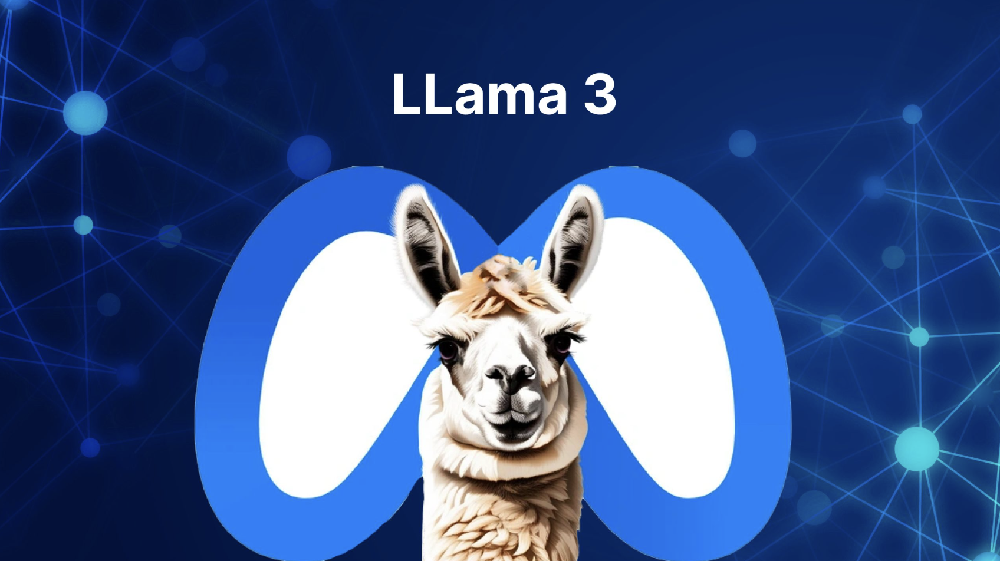
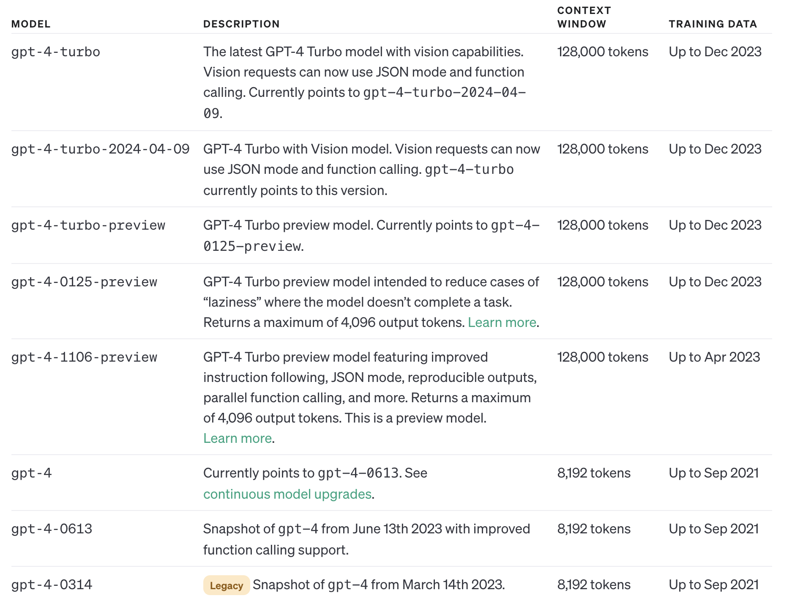

# LangChain

## Large Language Models
<p align="center">
    
    
    
</p>

## Context Window and Price

<p align="center">
    
</p>

<p align="center">
    
</p>
<p align="center">
    
    
</p>


## How to Solve?

**Extending the Context Window**

[Extending Context Window of Large Language Models via Positional Interpolation](https://arxiv.org/abs/2306.15595)

[YaRN: Efficient Context Window Extension of Large Language Models](https://arxiv.org/abs/2309.00071)

**Hold a Memory database**


## LongChain

### Text Split

分割文本需要两个参数：块有多大 (chunk_size) 以及每个块重叠的程度 (chunk_overlap)。 每个块之间的重叠对于帮助识别相关的相邻块非常重要。

<p align="center">
    
</p>

```python
from langchain.text_splitter import RecursiveCharacterTextSplitter

text_splitter = RecursiveCharacterTextSplitter(
    chunk_size = 100,
    chunk_overlap  = 0,
)

texts = text_splitter.create_documents([explanation])
```

[Chinese Text Splitter](https://github.com/chatchat-space/Langchain-Chatchat/blob/0f3453228fd937a87ae073ea9d4195d02920f6c2/text_splitter/chinese_text_splitter.py#L6)

### Vector Embedding

获得这些块后，我们需要将它们转化为嵌入(embeddings)。

**什么是embedding？**

<p align="center">
    
</p>

**为什么我们需要embedding？**
<p align="center">
    
    
</p>

<p align="center">
    
</p>


**怎么使用embedding？**
```python
from langchain.embeddings import OpenAIEmbeddings

# OpenAI 的 嵌入模型(embedding model)
embeddings = OpenAIEmbeddings(model_name="ada", openai_api_key=openai_api_key)

query_result = embeddings.embed_query("Your text string goes here")
print(query_result)
# Output a 1536 * 1 vector
# 一个长度为 1536 的数组。这个向量就包含了这句话的所有特征，这些特征包括词汇、语法等
# "-0.006929282422, -0.005336420078, ... -4547132536e-05,0.240475502243"
```

### Storage

<p align="center">
    
</p>

**Initialize**

```python
import time
from pinecone import Pinecone
from pinecone import ServerlessSpec

# Initialize Pinecone
pinecone.init(api_key='your-api-key')

cloud = 'aws'
region = 'us-east-1'

spec = ServerlessSpec(cloud=cloud, region=region)

index_name = 'langchain-retrieval-agent-fast'

if index_name in pc.list_indexes().names():
    pc.delete_index(index_name)

# we create a new index
# 每个 index 通常对应于一个特定的应用或数据集。
# 例如，
# 一个用于推荐系统的index可能存储用户或商品的embedding vector；
# 而另一个用于语义搜索的index可能存储文本的embedding vector。
pc.create_index(index_name, dimension=1536, metric='dotproduct', spec=spec)

# wait for index to be initialized
while not pc.describe_index(index_name).status['ready']:
    time.sleep(1)
```

```python
index = pc.Index(index_name)
index.describe_index_stats()

'''
{'dimension': 1536, 'index_fullness': 0.0,
 'namespaces': {}, 'total_vector_count': 0}

 new Pinecone index has a total_vector_count of 0, as we haven't added any vectors yet.
'''
```

**upload your dataset**

Assume your dataset look like:

<p align="center">
    
</p>

```python
index.upsert_from_dataframe(dataset.documents, batch_size=100)

index.describe_index_stats()

'''
{'dimension': 1536, 'index_fullness': 0.0, 
 'namespaces': {'': {'vector_count': 18891}}, 'total_vector_count': 18891}
'''
```

## Query
<p align="center">
    
</p>


### K-means

<p align="center">
    
</p>


常见的聚类算法有 K-Means，它可以将数据分成 k 个类别，其中 k 是预先指定的。以下是 k-means 算法的基本步骤：
- 选择 k 个初始聚类中心。
- 将每个数据点分配到最近的聚类中心。
- 计算每个聚类的新中心。
- 重复步骤 2 和 3，直到聚类中心不再改变或达到最大迭代次数。


## Product Quantization

在大规模数据集中，聚类算法最大的问题在于内存占用太大。
- 需要保存每个向量的坐标
- 需要多个聚类中心

在高维坐标系中，需要更多的聚类中心点将数据点分成更小的簇，才能提高分类的质量。否者，向量和自己的聚类中心距离很远，会极大的降低搜索的速度和质量。


<p align="center">
    
</p>

例如一个 128 维的向量，需要维护 2^64 个聚类中心才能维持不错的量化结果。

<p align="center">
    
</p>

解决这个问题的方法是将向量分解为多个子向量，然后对每个子向量独立进行量化，比如将 128 维的向量分为 8 个 16 维的向量，然后在 8 个 16 维的子向量上分别进行聚类，因为 16 维的子向量大概只需要 256 个聚类中心就能得到还不错的量化结果，所以就可以将码本的大小从 2^64 降低到 8 * 256 = 2048 个聚类中心


## Tree based

除了聚类以外，也可以通过构建树或者构建图的方式来实现近似最近邻搜索。这种方法的基本思想是每次将向量加到数据库中的时候，就先找到与它最相邻的向量，然后将它们连接起来，这样就构成了一个图。当需要搜索的时候，就可以从图中的某个节点开始，不断的进行最相邻搜索和最短路径计算，直到找到最相似的向量。

<p align="center">
    
</p>

## Query in RealWorld

```python
embed = OpenAIEmbeddings(
    model='ada', openai_api_key=openai_api_key
)

index = pc.Index(index_name)

vectorstore = Pinecone(index, embed.embed_query, "text")

query = "when was the college of engineering in the University of Notre Dame established?"

vectorstore.similarity_search(
    query, 
    k=3
)
```

The above code will output:

```python
[Document(page_content="In 1919 Father James Burns became president of Notre Dame, and in three years he produced an academic revolution that brought the school up to national standards by adopting the elective system and moving away from the university's traditional scholastic and classical emphasis. By contrast, the Jesuit colleges, bastions of academic conservatism, were reluctant to move to a system of electives. Their graduates were shut out of Harvard Law School for that reason. Notre Dame continued to grow over the years, adding more colleges, programs, and sports teams. By 1921, with the addition of the College of Commerce, Notre Dame had grown from a small college to a university with five colleges and a professional law school. The university continued to expand and add new residence halls and buildings with each subsequent president.", metadata={'title': 'University_of_Notre_Dame'}),

Document(page_content='The College of Engineering was established in 1920, however, early courses in civil and mechanical engineering were a part of the College of Science since the 1870s. Today the college, housed in the Fitzpatrick, Cushing, and Stinson-Remick Halls of Engineering, includes five departments of study – aerospace and mechanical engineering, chemical and biomolecular engineering, civil engineering and geological sciences, computer science and engineering, and electrical engineering – with eight B.S. degrees offered. Additionally, the college offers five-year dual degree programs with the Colleges of Arts and Letters and of Business awarding additional B.A. and Master of Business Administration (MBA) degrees, respectively.', metadata={'title': 'University_of_Notre_Dame'}),

Document(page_content='Since 2005, Notre Dame has been led by John I. Jenkins, C.S.C., the 17th president of the university. Jenkins took over the position from Malloy on July 1, 2005. In his inaugural address, Jenkins described his goals of making the university a leader in research that recognizes ethics and building the connection between faith and studies. During his tenure, Notre Dame has increased its endowment, enlarged its student body, and undergone many construction projects on campus, including Compton Family Ice Arena, a new architecture hall, additional residence halls, and the Campus Crossroads, a $400m enhancement and expansion of Notre Dame Stadium.', metadata={'title': 'University_of_Notre_Dame'})]
```


# Examples

[Chatbot Agent With LongChain](https://colab.research.google.com/github/pinecone-io/examples/blob/master/docs/langchain-retrieval-agent.ipynb)

[GPT4 with Retrieval Augmentation](https://colab.research.google.com/github/pinecone-io/examples/blob/master/docs/gpt-4-langchain-docs.ipynb)

[Chatchat](https://github.com/chatchat-space/Langchain-Chatchat/tree/master)


